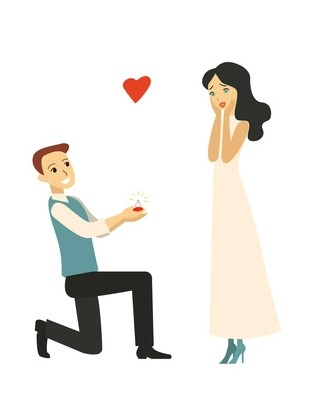

<!DOCTYPE html>
<html lang="en" dir="ltr">
   <header>
        <meta charset="utf-8">
        <title>www.tanvir.com</title>
        <meta name="viewport" content="width=device-width,initial-scale=1.0">
        <link rel="stylesheet"  href="css/all.min.css"  />
        <link rel="stylesheet"  href="css/fontawesome.min.css" />
       <link rel="stylesheet"  href="stylish.css"  />
       
    
  </header>
<body>
     <nav>
          <label class="logo">DesignerTANVIR</lebel>
          <ul>
              <li class="active"><a href="#">Home</a></li>
              <li><a href="#">About</a></li>
              <li><a href="#">services</a></li>
              <li><a href="#">contact</a></li>
              <li><a href="#">feedback</a></li>
          </ul>
          <input type="checkbox" id="check"
            <label for="check" class="chectbtn">
             <i class="fas fa-align-justify"></i>
          </label>
     </nav>
     <section>
           

               <h1>LIFE HAS NO CTRL+Z</h1>
               
Subscribe Easy Tutorials Youtube channel to watch more video  press the bell icon to get latest update

               

                    <button type='button'>WATCH MORE </button>
                    <button type='button'> SUBSCRIBE </button>
               

           

     </section>

     

           

                

                        
          
                

                    

                    <h1>My Online Experience </h1>
                    
Being a college student, it is important that one learns to become computer literate. 
                     Although I have had the opportunity to go on the Internet, 
                      I have never had the opportunity to go beyond doing research, . 
                    romance, or excitement. In which case, I did not need from a…show more content…

                     
Being a child I did not understand why that had happened.  
                      I knew I changed the water a couple of times and also fed them.  
                     So what could have gone wrong? From that day on I decided 
                      I would never have any more fish. I was traumatized and never again wanted   
                     to be responsible for fishes. I felt that I had killed two   
                     fish and I was afraid of trying again. 

                    

                         

                                <a><i class="fab fa-facebook-f"></i></a>
                                <a><i class="fas fa-dove"></i></a>
                                <a><i class="fab fa-facebook-messenger"></i></a>
                                <a><i class="fas fa-heart"></i></a>
                         

                
            

          
    

    

         

              

                  

                   <h1>01</h1>
                  <h3>Computer</h3>
                  
 I have a joke  on programing but  it only my computer

                  <a href='#'> Read more </a>
                  
              

              

              
         

          

              

                  

                   <h1>02</h1>
                  <h3>STATUS</h3>
                  
I know hacking  it doesn't mean  I can hack facbook  account for you

                  <a href='#'> Read more </a>
                  
              

              

              
         

          

              

                  

                   <h1>03</h1>
                  <h3>LIFE</h3>
                  
What Even   You Deside To Do,  Make Sure It Makes   You Happy.

                  <a href='#'> Read more </a>
                  
              

              

              
         

    

    

            

                

                    <h2>Loging</h2>
                    <form>
                        

                            <input type="text" placeholder="Username">
                            <i class="fas fa-user"></i>
                        
                        

                        

                            <input type="password" placeholder="Password">
                            <i class="fas fa-eye"></i>
                        
                        

                        <label class='remeber'><input type="checkbox" >Remeber Me</label>
                        

                            <input type="submit" valeu='Loging'>
                            
                        
                        

                    </form>
                    
Forget password

                    
Need a account

                
                
                
                

            
            
            
            

     

     

          

            <i class="fas fa-theater-masks"></i>
             <h1>status</h1>
            
blank text

     
          

          

            <i class="fab fa-napster"></i>
             <h1>status</h1>
            
blank text

     
          

          

            <i class="fab fa-jedi-order"></i>
             <h1>status</h1>
            
blank text

     
          

     
     
     

     

</body>
</html>
